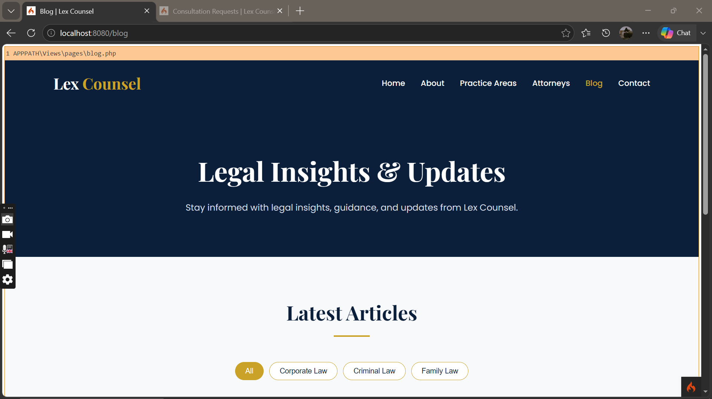
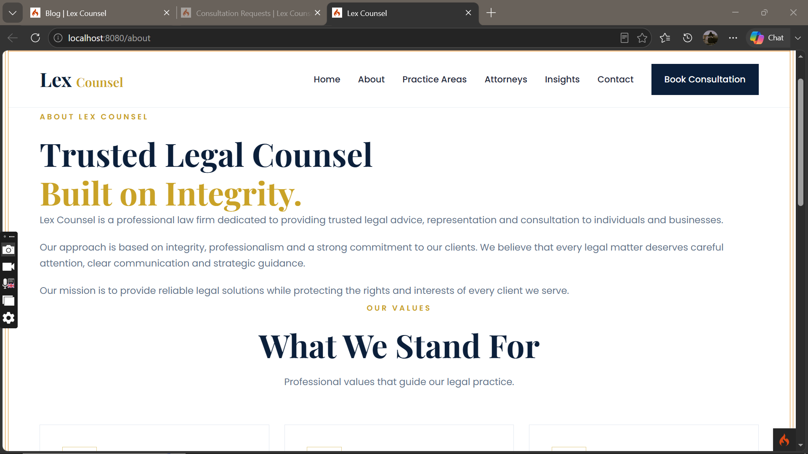
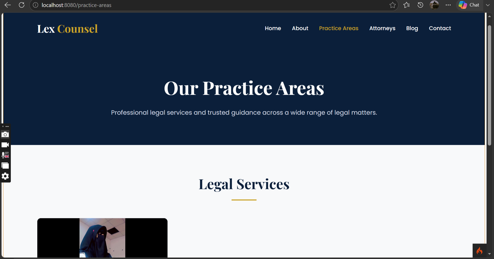
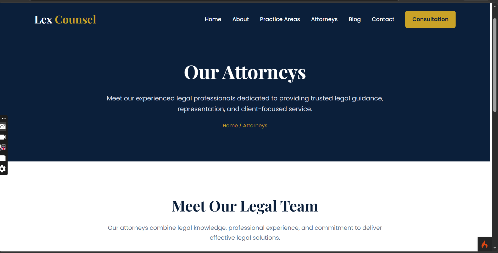
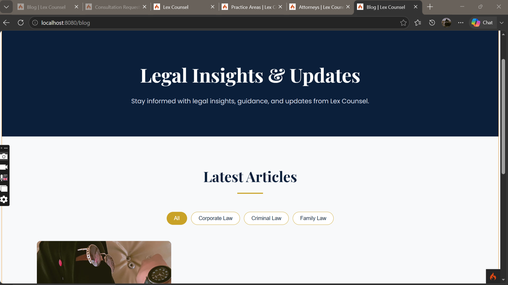
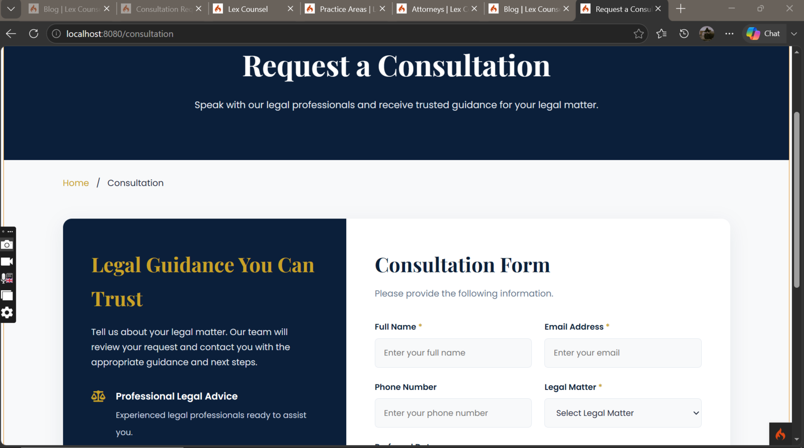
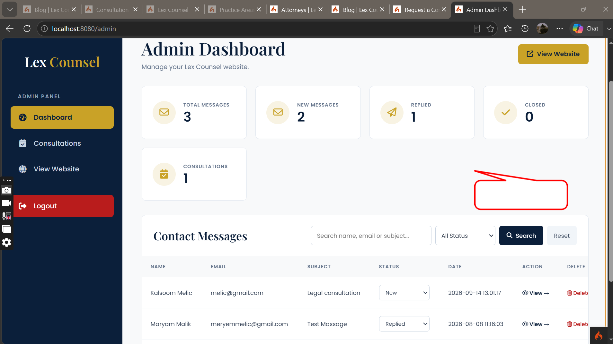

# Lex Counsel

### Justice. Integrity. Excellence.

Lex Counsel is a professional lawyer and legal consultation website developed using CodeIgniter 4 and PHP.

The website provides information about legal practice areas, attorneys, legal blog posts, contact services, and consultation requests. It also includes an administrative dashboard for managing website content and client consultations.

---

## Features

- Professional responsive lawyer website
- Home page with professional legal design
- About page
- Practice Areas
- Practice Area details
- Attorneys listing
- Individual Attorney profiles
- Legal Blog
- Blog post details
- Contact form
- Consultation booking form
- Consultation management through Admin Dashboard
- Attorney management
- Practice Area management
- Blog post management
- Category management
- Admin authentication
- Password change and password recovery
- Responsive design for desktop, tablet, and mobile
- MySQL database integration

---
---

## Screenshots

### Home Page



### About Page



### Practice Areas



### Attorneys



### Legal Blog



### Consultation



### Admin Dashboard



---

## Technology Stack

- PHP 8.2+
- CodeIgniter 4.7.4
- MySQL
- HTML5
- CSS3
- JavaScript
- Bootstrap / Responsive CSS
- Font Awesome
- Composer
- Git & GitHub

---

## Project Structure

```text
Lex-Counsel/
│
├── app/
│   ├── Config/
│   ├── Controllers/
│   ├── Models/
│   └── Views/
│
├── public/
│   └── uploads/
│
├── writable/
│
├── tests/
│
├── composer.json
├── composer.lock
├── spark
├── .env
└── README.md